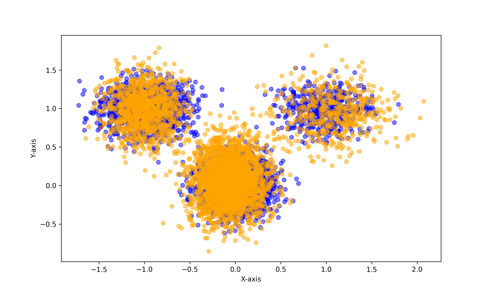
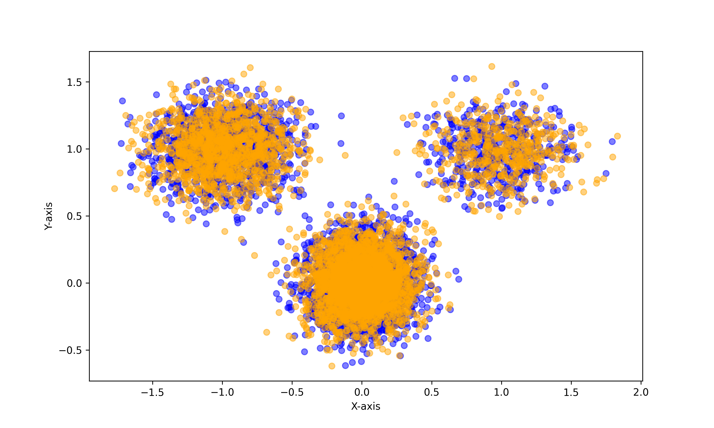

# PRODiGI: Fast & Direct Generative Program Inference from Empirical Data

Official implementation of:

> **From Data to Program: Fast & Direct Generative Program Inference from Empirical Data**

This repository contains the code and pretrained models for **PRODiGI**, including:

* Training code for the PRODiGI model
* A pretrained PRODiGI checkpoint for datasets with up to **50 dimensions**
* Zero-shot program inference
* Program fine-tuning from empirical data

## Installation

Clone the repository and install the required dependencies:

```bash
git clone <REPOSITORY_URL>
cd <REPOSITORY_NAME>
pip install -r requirements.txt
```

The complete list of Python dependencies is provided in [`requirements.txt`](requirements.txt).

## Repository Structure

```text
.
├── checkpoint/
│   ├── epoch_1000_base.pt
│   └── epoch_1000.pt
├── images/
│   ├── zeroshot.png
│   └── finetune.png
├── inference_zeroshot.py
├── inference_finetune.py
├── requirements.txt
└── train/
    └── train.py
```

## Pretrained Checkpoint

The `checkpoint/` directory contains the latest pretrained PRODiGI model for datasets with up to **50 dimensions**.

For storage efficiency, the checkpoint is split across two files:

* `checkpoint/epoch_1000_base.pt` — program decoder weights
* `checkpoint/epoch_1000.pt` — dataset encoder weights

Both files are required for inference.

## Zero-Shot Inference

`inference_zeroshot.py` provides an example of using the pretrained PRODiGI model for **zero-shot program inference**.

Run:

```bash
python3 inference_zeroshot.py
```

The script produces the following example:

<p align="center">
  
</p>

## Fine-Tuning

`inference_finetune.py` demonstrates how to fine-tune a zero-shot program using empirical data to improve the inferred program.

Run:

```bash
python3 inference_finetune.py
```

The script produces the following example:

<p align="center">
  
</p>

## Training

The PRODiGI training pipeline is implemented in:

```text
train/train.py
```

The training script supports multiple configurations corresponding to the training stages used to obtain the released 50-dimensional checkpoint.

### Pretraining

To pretrain the model without normalization:

```bash
python3 train/train.py pretrain50
```

### PRODiGI Training

To continue training from the pretraining checkpoint:

```bash
python3 train/train.py prodigi50_start
```

To continue PRODiGI training:

```bash
python3 train/train.py prodigi50
```

## Reproducibility

The released checkpoint and inference scripts provide a direct way to reproduce the qualitative examples shown above. The training configurations are provided to reproduce the training pipeline used to obtain the released checkpoint.

## Citation

If you find this code useful in your research, please cite:

```bibtex
@inproceedings{prodigi,
  title     = {From Data to Program: Fast & Direct Generative Program Inference from Empirical Data},
  author    = {Hidden for anonymity},
  booktitle = {International Conference on Learning Representations},
  year      = {2026},
  doi       = {},
}
```

